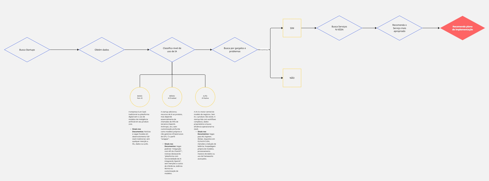
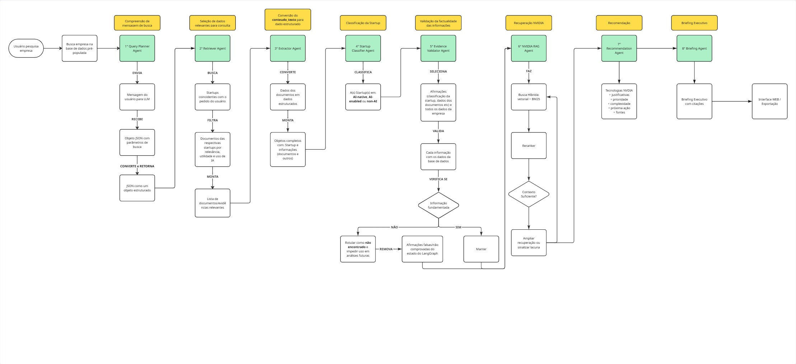

# processo-seletivo-ia

Repositório referente ao projeto de automação do Processo Seletivo da liga Inteli Academy do Instituto de Tecnologia e Liderança.

Desenvolvido por: Lucas Bianchezzi Oliveira (@LucasBO7)

## 1. Contexto

Apresentado no documento TAPI: `/documents/TAPI_PS_IA.pdf`

## 2. Problema

## 3. Solução

### 3.1. Diagrama do Pipeline MVP do projeto

