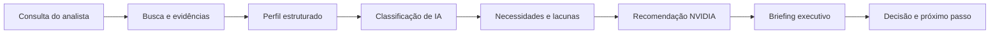
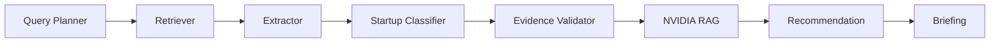

# NVIDIA Startup AI Radar

O NVIDIA Startup AI Radar ajuda a NVIDIA a identificar startups brasileiras
com uso relevante de inteligência artificial, entender suas necessidades
técnicas e encontrar oportunidades de adoção da plataforma NVIDIA.

Este projeto foi desenvolvido para o processo seletivo da Inteli Academy.

## Por que o produto existe

Avaliar startups manualmente exige ler muitas fontes, separar fatos de
suposições e relacionar cada necessidade a uma tecnologia adequada. O Radar
automatiza esse trabalho mantendo as evidências e as fontes visíveis para
revisão humana.

## O que a demonstração entrega

- busca de uma startup em linguagem natural;
- classificação do uso de IA: `non-AI`, `AI-enabled` ou `AI-native`;
- identificação de produto, stack, necessidades e lacunas técnicas;
- recomendações NVIDIA com prioridade, complexidade e fontes;
- briefing executivo com citações e exportação em Markdown.

## Visão do produto



## Pipeline multiagente



Cada etapa recebe dados estruturados da etapa anterior. Evidências sem suporte
são marcadas ou removidas antes de influenciar recomendações.

## Como testar rapidamente

Para uma demonstração sem depender de Groq, PostgreSQL ou Qdrant:

```powershell
npm install
npm run demo
```

Acesse `http://localhost:5173` e pesquise qualquer startup. O selo “Modo
demonstração” identifica a resposta simulada.

Para executar o fluxo real, consulte o [README técnico do backend](backend/README.md).

## Escopo e limites atuais

O MVP é uma ferramenta de apoio à análise, não substitui a avaliação humana.
Ele não possui autenticação, histórico persistido de análises, streaming de
progresso ou implantação em produção. A base de startups é pré-populada e o
conhecimento NVIDIA é limitado às fontes configuradas no projeto.

## Documentação

- [Guia técnico do backend](backend/README.md)
- [Especificações e decisões](specs/)
- [TAPI do processo seletivo](documents/TAPI_PS_IA.pdf)

Desenvolvido por Lucas Bianchezzi Oliveira — [@LucasBO7](https://github.com/LucasBO7).
