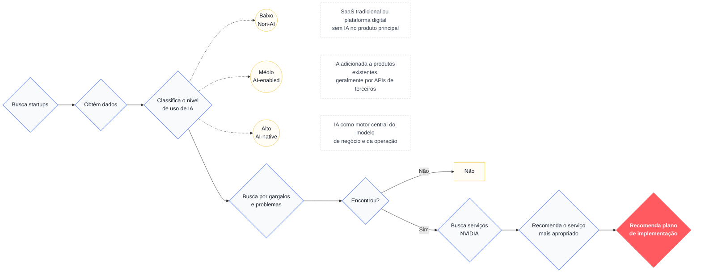

# NVIDIA Startup AI Radar

Plataforma idealizada para apoiar a NVIDIA na identificação, qualificação e nutrição de startups brasileiras com uso intensivo de inteligência artificial. Este repositório faz parte do Processo Seletivo da liga Inteli Academy, do Instituto de Tecnologia e Liderança.

Desenvolvido por Lucas Bianchezzi Oliveira ([@LucasBO7](https://github.com/LucasBO7)).

> Estado atual: fundações independentes do frontend e do backend. O backend fornece contratos, persistência, saúde e observabilidade, mas não implementa a lógica dos agentes nem expõe uma rota de análise.

## 1. Contexto

O contexto completo, os entregáveis e os critérios do projeto estão no [TAPI do Processo Seletivo](documents/TAPI_PS_IA.pdf). O desafio consiste em analisar uma base previamente populada de startups, identificar sua maturidade no uso de IA e recomendar tecnologias NVIDIA com evidências rastreáveis.

O scraping e a coleta automatizada de dados na web estão fora do escopo do MVP.

## 2. Problema

O fluxo abaixo resume a identificação de startups, a classificação de maturidade em IA e a busca por oportunidades de adoção da stack NVIDIA.



Os textos explicativos foram condensados para preservar a legibilidade no GitHub. A imagem original permanece disponível em [documents/problem-understanding-diagram.jpg](documents/problem-understanding-diagram.jpg).

## 3. Solução

### 3.1. Diagrama do pipeline MVP

```mermaid
flowchart LR
    user([Usuário pesquisa<br/>uma empresa]) --> database[Busca na base de dados<br/>pré-populada]

    subgraph S1[1. Compreensão da mensagem de busca]
        direction TB
        planner[Query Planner Agent]
        planner_input[Mensagem do usuário<br/>para o LLM]
        planner_output[Objeto estruturado com<br/>parâmetros de busca]
        planner -->|Envia| planner_input
        planner_input -->|Recebe e converte| planner_output
    end

    subgraph S2[2. Seleção de dados relevantes]
        direction TB
        retriever[Retriever Agent]
        matching[Startups coincidentes<br/>com o pedido]
        documents[Documentos e evidências<br/>relevantes]
        retriever -->|Busca| matching
        matching -->|Filtra| documents
    end

    subgraph S3[3. Conversão do conteúdo em dado estruturado]
        direction TB
        extractor[Extractor Agent]
        raw_data[Dados dos documentos<br/>em formato não estruturado]
        structured[Perfil estruturado da startup<br/>com informações e fontes]
        extractor -->|Converte| raw_data
        raw_data -->|Monta| structured
    end

    subgraph S4[4. Classificação da startup]
        direction TB
        classifier[Startup Classifier Agent]
        maturity[AI-native, AI-enabled<br/>ou non-AI]
        classifier -->|Classifica| maturity
    end

    subgraph S5[5. Validação da factualidade]
        direction TB
        validator[Evidence Validator Agent]
        claims[Afirmações, documentos<br/>e dados da empresa]
        grounded{Informação<br/>fundamentada?}
        reject[Rotular como não encontrada<br/>e impedir uso futuro]
        remove[Remover afirmações falsas<br/>ou não comprovadas]
        keep[Manter]
        validator -->|Seleciona| claims
        claims -->|Valida| grounded
        grounded -- Não --> reject
        reject -->|Remove| remove
        grounded -- Sim --> keep
    end

    subgraph S6[6. Recuperação NVIDIA]
        direction TB
        rag[NVIDIA RAG Agent]
        hybrid[Busca híbrida<br/>vetorial + BM25]
        reranker[Reranker]
        enough{Contexto<br/>suficiente?}
        expand[Ampliar recuperação<br/>ou sinalizar lacuna]
        rag -->|Faz| hybrid
        hybrid --> reranker
        reranker --> enough
        enough -- Não --> expand
        expand --> hybrid
    end

    subgraph S7[7. Recomendação]
        direction TB
        recommendation[Recommendation Agent]
        recommendation_output["Tecnologias NVIDIA, justificativas,<br/>prioridade, complexidade e fontes"]
        recommendation --> recommendation_output
    end

    subgraph S8[8. Briefing executivo]
        direction TB
        briefing[Briefing Agent]
        report[Briefing executivo<br/>com citações]
        briefing --> report
    end

    web[Interface web<br/>e exportação]

    database --> planner
    planner_output --> retriever
    documents --> extractor
    structured --> classifier
    maturity --> validator
    keep --> rag
    remove --> rag
    enough -- Sim --> recommendation
    recommendation_output --> briefing
    report --> web

    classDef agent fill:#a7e8c2,stroke:#374151,color:#111827,stroke-width:1.5px;
    classDef decision fill:#ffffff,stroke:#374151,color:#111827;
    classDef output fill:#ffffff,stroke:#4b5563,color:#111827;

    class planner,retriever,extractor,classifier,validator,rag,recommendation,briefing agent;
    class grounded,enough decision;
    class user,database,planner_input,planner_output,matching,documents,raw_data,structured,maturity,claims,reject,remove,keep,hybrid,reranker,expand,recommendation_output,report,web output;
    style S1 fill:#fffdf2,stroke:#eab308
    style S2 fill:#fffdf2,stroke:#eab308
    style S3 fill:#fffdf2,stroke:#eab308
    style S4 fill:#fffdf2,stroke:#eab308
    style S5 fill:#fffdf2,stroke:#eab308
    style S6 fill:#fffdf2,stroke:#eab308
    style S7 fill:#fffdf2,stroke:#eab308
    style S8 fill:#fffdf2,stroke:#eab308
```



A versão visual original está em [documents/mvp-pipeline-diagram.jpg](documents/mvp-pipeline-diagram.jpg).

## 4. Escopo atual

Esta fundação inclui:

- especificações SDD do estágio atual;
- frontend React com TypeScript e Vite;
- uma página inicial que comunica o estado e os limites do projeto;
- backend Python 3.12 com FastAPI, contratos LangGraph e arquitetura modular;
- PostgreSQL 16, migrações Alembic, Qdrant e fronteira BM25;
- endpoints de liveness e readiness, correlação, CORS e logs JSON;
- testes unitários, arquiteturais e de integração, qualidade estática e CI;
- documentação das decisões técnicas e operacionais.

Não estão incluídos neste estágio:

- lógica ou prompts dos agentes LangGraph/LangChain;
- grafo funcional compilado ou rota de análise;
- ingestão de conteúdo, embeddings ou chamadas reais a provedores de IA;
- autenticação, implantação ou Dockerfile da API;
- scraping ou ingestão automática de fontes externas.

## 5. Organização do repositório

### 5.1. Estrutura atual

```text
.
├── .vscode/                       # Configurações do ambiente de desenvolvimento
├── documents/                     # TAPI, diagramas e decisões arquiteturais
├── specs/
│   ├── 001-project-foundation/ # Fundação do frontend, aprovada e implementada
│   └── 002-backend-foundation/ # Fundação do backend implementada
├── backend/
│   ├── migrations/             # Schema PostgreSQL versionado
│   ├── src/app/                # API, aplicação, domínio, grafo e infraestrutura
│   └── tests/                  # Testes unitários, arquiteturais e de integração
├── src/                           # Frontend React existente
│   ├── components/
│   ├── pages/
│   ├── styles/
│   └── test/
├── index.html
├── package.json
└── vite.config.ts
```

### 5.2. Arquitetura do backend

A especificação 002 implementa um monólito modular. A organização abaixo
preserva os oito agentes do pipeline e separa regras de negócio, orquestração e
integrações externas:

```text
backend/
├── pyproject.toml, uv.lock          # Projeto Python reproduzível
├── migrations/                    # Schema PostgreSQL versionado
├── scripts/                       # Orientação para operações futuras
├── src/app/
│   ├── api/                      # FastAPI, health, middleware e erros
│   ├── application/              # Casos de uso e portas internas
│   ├── domain/                   # Entidades, evidências e recomendações
│   ├── graph/
│   │   ├── state.py              # Estado compartilhado do LangGraph
│   │   ├── nodes.py              # Identificadores dos oito agentes
│   │   ├── contracts.py          # Contrato uniforme dos nós
│   │   ├── builder.py            # Montagem do grafo
│   ├── infrastructure/          # PostgreSQL, Qdrant, BM25 e provedores
│   ├── core/                    # Configuração, logging e ciclo de vida
│   └── main.py                  # Composição e entrada da API
└── tests/                         # Testes unitários, de integração e arquitetura
```

Os futuros `query_planner`, `retriever`, `extractor`, `classifier`, `validator`,
`nvidia_rag`, `recommender` e `briefing` ficam conceitualmente em `graph/agents`.
As antigas `db_tools` e `rag_tools` são divididas entre contratos de
`application` e adaptadores de `infrastructure`, evitando que os agentes dependam
diretamente de SQL ou SDKs. A estrutura detalhada e os limites desta primeira
entrega estão no [plano da fundação do backend](specs/002-backend-foundation/plan.md).

## 6. Pré-requisitos

- Node.js 20.19 ou superior;
- npm 10 ou superior;
- Python 3.12 ou superior;
- [uv](https://docs.astral.sh/uv/) 0.11 ou superior;
- acesso a uma instância PostgreSQL 16 e a uma instância Qdrant compatível;
- VS Code opcional, para utilizar as extensões recomendadas do workspace.

Docker não é um pré-requisito. O `compose.yaml` permanece disponível apenas
como alternativa opcional para iniciar PostgreSQL e Qdrant localmente.

## 7. Instalação e execução

### 7.1. Frontend

Na raiz do repositório:

```bash
npm install
npm run dev
```

O Vite exibirá no terminal o endereço local da aplicação, normalmente `http://localhost:5173`.

Comandos disponíveis:

```bash
npm run dev        # inicia o servidor de desenvolvimento
npm run lint       # verifica o código com ESLint
npm run test       # executa os testes uma vez
npm run test:watch # executa os testes em modo interativo
npm run build      # valida tipos e gera a versão de produção
npm run preview    # serve localmente o build de produção
```

### 7.2. Backend

Crie a configuração local a partir do exemplo. O arquivo `backend/.env` é ignorado pelo Git:

```powershell
Copy-Item backend/.env.example backend/.env
```

Informe em `backend/.env` as URLs de instâncias PostgreSQL 16 e Qdrant que já
estejam disponíveis. Elas podem ser serviços instalados diretamente na máquina,
executados em outro host ou fornecidos por um ambiente remoto.

Se preferir usar containers somente para essas dependências, o Compose é
opcional:

```bash
docker compose up -d
docker compose ps
```

Instale exatamente as dependências registradas no lockfile e aplique as migrações:

```bash
uv sync --project backend --locked --all-groups
uv run --project backend alembic -c backend/alembic.ini upgrade head
```

Inicie a API:

```bash
uv run --project backend startup-radar
```

No Windows, use esse entrypoint em vez de chamar `uvicorn` diretamente: ele
seleciona o event loop compatível com o Psycopg assíncrono. O reload continua
habilitado quando `APP__ENVIRONMENT=local`.

Recursos locais:

- liveness: `http://127.0.0.1:8000/health/live`;
- readiness: `http://127.0.0.1:8000/health/ready`;
- Swagger UI: `http://127.0.0.1:8000/api/v1/docs`;
- contrato OpenAPI: `http://127.0.0.1:8000/api/v1/openapi.json`.

Caso tenha escolhido a alternativa com Compose, encerre os serviços com:

```bash
docker compose down
```

Os volumes do Compose são preservados por padrão. Esse comando não se aplica a
instâncias instaladas diretamente ou fornecidas externamente.

### 7.3. Variáveis do backend

Todas as chaves aceitas e valores locais não sensíveis estão em `backend/.env.example`. Os principais grupos são:

| Prefixo | Responsabilidade |
| --- | --- |
| `APP__` | ambiente e nível de log |
| `HTTP__` | host, porta e allowlist CORS |
| `POSTGRES__` | URL, pool e timeout do PostgreSQL |
| `QDRANT__` | URL, coleção, dimensão, distância e timeout |
| `CHAT__` | futuro modelo de chat |
| `EMBEDDINGS__` | futuro modelo de embeddings |
| `RERANKER__` | adaptador de reranking Cohere |

Use dois sublinhados para separar grupo e campo. Chaves reais são opcionais nesta fundação e nunca devem ser adicionadas ao `.env.example` ou aos logs.

### 7.4. Qualidade e testes do backend

Execute cada verificação separadamente:

```bash
uv run --project backend ruff format --check backend/src backend/tests backend/migrations
uv run --project backend ruff check backend/src backend/tests backend/migrations
uv run --project backend mypy --config-file backend/pyproject.toml backend/src backend/tests
uv run --project backend lint-imports --config backend/.importlinter
uv run --project backend pytest -c backend/pyproject.toml backend/tests -m "not integration"
```

Ou execute a verificação local agregada:

```bash
uv run --project backend startup-radar-check
```

Para os testes de integração, PostgreSQL e Qdrant devem estar ativos e as variáveis de `backend/.env` disponíveis no ambiente:

```powershell
$env:RUN_INTEGRATION_TESTS = "1"
uv run --project backend pytest -c backend/pyproject.toml backend/tests/integration
```

A origem dos serviços não interfere nos testes: eles podem ser locais, externos
ou, opcionalmente, iniciados pelo Compose.

Na integração contínua, PostgreSQL e Qdrant continuam sendo executados como
service containers isolados no runner do GitHub Actions. Essa decisão garante
testes reproduzíveis e não exige Docker no ambiente local de desenvolvimento.

Para atualizar uma dependência de forma consciente, altere sua restrição com `uv add --project backend <pacote>` e revise o diff de `backend/pyproject.toml` e `backend/uv.lock` antes de executar os testes.

### 7.5. Migrações

```bash
uv run --project backend alembic -c backend/alembic.ini current
uv run --project backend alembic -c backend/alembic.ini upgrade head
uv run --project backend alembic -c backend/alembic.ini downgrade -1
```

O schema nunca deve ser criado automaticamente na inicialização da API. Consulte [diagnóstico do backend](documents/backend-troubleshooting.md) em caso de falha de configuração, readiness, migração ou coleção vetorial.

## 8. Desenvolvimento orientado por especificações

O projeto utiliza SDD (Spec Driven Development): nenhuma funcionalidade deve começar diretamente pelo código. Neste repositório, SDD é um processo de trabalho versionado em Markdown, e não uma biblioteca ou CLI. Portanto, não existe pacote SDD para instalar ou comando especial para executar.

Cada mudança deve responder, nesta ordem, a três perguntas:

1. **O que precisa ser entregue?** — `spec.md`.
2. **Como será construído?** — `plan.md`.
3. **Em quais passos verificáveis?** — `tasks.md`.

A fundação mais recente em [specs/002-backend-foundation](specs/002-backend-foundation/) funciona como exemplo completo.

### 8.1. Criar uma especificação

Escolha o próximo número sequencial e um nome curto em `kebab-case`. Por exemplo, para uma futura tela de consulta:

```text
specs/
└── 003-startup-search/
    ├── spec.md
    ├── plan.md
    └── tasks.md
```

No PowerShell, a pasta pode ser criada com:

```powershell
New-Item -ItemType Directory -Path "specs/003-startup-search"
```

Não reutilize um número e não misture funcionalidades independentes na mesma pasta.

### 8.2. Escrever `spec.md`: definir o que será entregue

Comece pela necessidade e pelos resultados observáveis, sem decidir detalhes de implementação prematuramente.

```markdown
# Especificação 003: busca de startups

## Status

Proposta.

## Contexto

Explique o problema e quem é afetado por ele.

## Objetivos

- Descreva os resultados esperados.

## Histórias do usuário

### US-01 — Consultar startups

Como usuário, quero pesquisar startups para encontrar empresas relevantes.

Critérios de aceite:

- A consulta aceita os filtros definidos.
- Os estados de carregamento, sucesso, vazio e erro estão especificados.

## Requisitos funcionais

- **RF-01:** descrever uma capacidade verificável do sistema.

## Requisitos não funcionais

- **RNF-01:** descrever acessibilidade, desempenho, segurança ou qualidade.

## Restrições

- Registre limites técnicos ou de escopo.

## Fora do escopo

- Registre explicitamente o que não será desenvolvido.

## Matriz de rastreabilidade

| História | Requisitos    | Validação                        |
| -------- | ------------- | -------------------------------- |
| US-01    | RF-01, RNF-01 | Teste ou inspeção correspondente |
```

Uma especificação está pronta para revisão quando:

- o problema e o usuário estão claros;
- cada requisito pode ser verificado;
- os casos de erro e os limites foram considerados;
- o que está fora do escopo foi registrado;
- não há decisão arquitetural disfarçada de requisito, salvo quando ela for uma restrição real.

### 8.3. Validar a especificação antes de planejar

Apresente `spec.md` às pessoas responsáveis pelo projeto. Durante a revisão:

1. remova ambiguidades;
2. registre decisões e restrições levantadas;
3. ajuste os critérios de aceite;
4. mantenha o status como `Proposta` enquanto houver decisões pendentes;
5. altere o status para `Aprovada` somente após a validação explícita.

Não inicie a implementação enquanto a especificação estiver como `Proposta`.

### 8.4. Escrever `plan.md`: definir como construir

Com a especificação aprovada, documente a solução técnica e relacione cada decisão aos requisitos.

```markdown
# Plano 003: busca de startups

## Estratégia

Resuma a abordagem escolhida.

## Arquitetura dentro do escopo

Descreva componentes, responsabilidades e fluxo de dados.

## Decisões

### D-01 — Título da decisão

Explique a escolha, as alternativas consideradas e as consequências.

## Verificação

1. Liste os testes e comandos que comprovam a entrega.

## Riscos e mitigação

| Risco              | Mitigação            |
| ------------------ | -------------------- |
| Risco identificado | Tratamento planejado |
```

O plano deve respeitar todo item marcado como fora do escopo. Caso a solução exija mudar um requisito, volte ao `spec.md`, obtenha nova aprovação e somente depois atualize o plano.

### 8.5. Escrever `tasks.md`: dividir o trabalho

Transforme o plano em tarefas pequenas, ordenadas e verificáveis. Cada tarefa deve apontar para pelo menos uma história ou requisito.

```markdown
# Tarefas 003: busca de startups

## Implementação

- [ ] **T-01 [US-01, RF-01]** Criar o formulário de consulta.
- [ ] **T-02 [US-01, RNF-01]** Implementar os estados visuais definidos.

## Verificação

- [ ] **T-03 [US-01]** Executar os testes da funcionalidade.
- [ ] **T-04 [US-01]** Executar lint e build.
```

Use `[ ]` para tarefas pendentes e altere para `[x]` apenas após implementar e verificar o resultado. Se surgir trabalho não previsto, registre uma nova tarefa antes de executá-lo.

### 8.6. Implementar uma tarefa por vez

Para cada item de `tasks.md`:

1. selecione a próxima tarefa pendente cujas dependências estejam concluídas;
2. releia os requisitos associados na especificação;
3. implemente somente o necessário para cumprir a tarefa;
4. crie ou atualize os testes correspondentes;
5. execute a validação específica da tarefa;
6. marque a tarefa como concluída;
7. registre no plano qualquer decisão técnica relevante que tenha surgido.

Se a implementação revelar uma mudança de escopo, interrompa o código e atualize primeiro a especificação.

### 8.7. Validar a entrega

Para mudanças no frontend atual, execute:

```bash
npm run lint
npm run test
npm run build
```

Além dos comandos automáticos:

- percorra todos os critérios de aceite de `spec.md`;
- confira os estados principais e de erro aplicáveis;
- verifique se todos os requisitos aparecem na matriz de rastreabilidade;
- confirme que nenhuma tarefa permanece aberta;
- valide se README, especificação e código descrevem o mesmo comportamento.

### 8.8. Encerrar a especificação

Quando todos os critérios forem atendidos:

1. marque todas as tarefas concluídas em `tasks.md`;
2. registre no `plan.md` eventuais desvios da solução original;
3. altere o status de `spec.md` para `Concluída`;
4. atualize o README caso a instalação, os comandos ou a estrutura tenham mudado;
5. faça uma revisão final do diff antes do commit.

Uma especificação não deve ser marcada como concluída somente porque o código foi escrito: testes, documentação e critérios de aceite também precisam estar satisfeitos.

### 8.9. Resumo do ciclo SDD

```text
Ideia
  ↓
spec.md em estado Proposta
  ↓
Revisão e aprovação
  ↓
plan.md
  ↓
tasks.md
  ↓
Implementação incremental
  ↓
Lint + testes + build + critérios de aceite
  ↓
Especificação Concluída
```

As alternativas retiradas do escopo desta fundação estão registradas em [documents/decisoes-tecnicas-removidas.md](documents/decisoes-tecnicas-removidas.md).

## 9. Próxima etapa

A lógica dos oito agentes, a ingestão de dados, o fluxo funcional completo e a integração com o frontend continuam exigindo especificações próprias. Cada nova etapa deve reutilizar as portas e os modelos da fundação sem acoplar domínio a FastAPI, SQLAlchemy, Qdrant ou SDKs externos.
